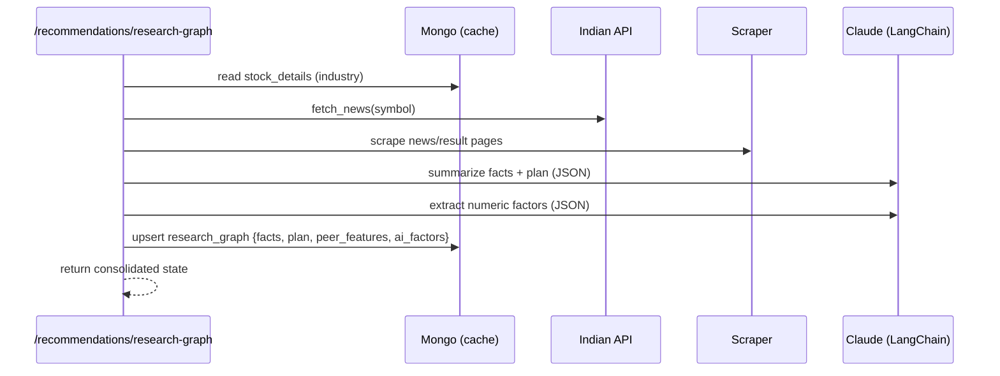
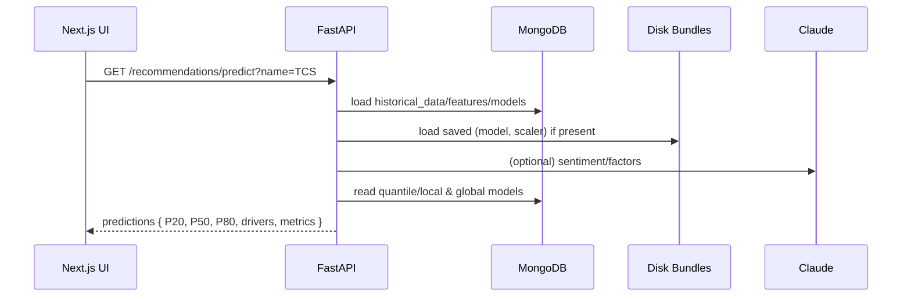
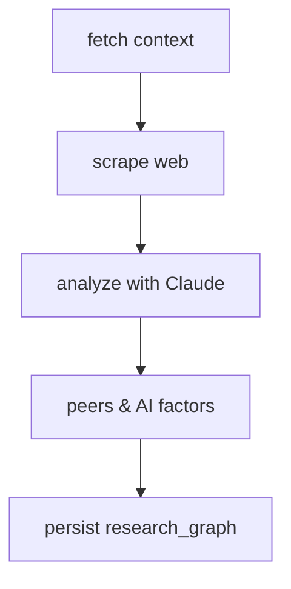

# Investment Advisor – End-to-End Research, Forecasting, and Insights

This project is a full‑stack research and forecasting assistant for Indian equities. It ingests market data, fundamentals and announcements, augments with AI research (Anthropic via LangChain/LangGraph), engineers features, trains quantile time‑series models, and serves interactive predictions with explainability and charts.

## Table of Contents
- Overview
- Architecture
- Data Sources and Collections
- Feature Store (features_daily)
- Modeling: Local, Global, and Ensembling
- AI Research: LangChain + LangGraph
- Backtesting and Accuracy
- API Reference
- Frontend UX
- Dev Setup
- Schedules and Automation
 - End-to-end Flow Diagrams
 - External APIs used
 - How predictions are produced (step-by-step)

---

## Overview
- Pulls stock details, historical prices, historical stats, corporate actions, recent announcements, 52‑week levels, and price shockers.
- Aggregates news (company + industry; peers), with scraping fallbacks (BeautifulSoup, Scrapy, Selenium).
- Uses Anthropic (Claude) to extract numeric forward factors, summarize news, and produce peer‑aware research via LangChain and LangGraph.
- Builds a daily feature store per symbol (`features_daily`).
- Trains quantile LightGBM models (local per symbol, and global across symbols). Produces P20/P50/P80, SHAP drivers, and blends global/local P50.
- Backtests with expanding windows and returns quantile series.
- Persists everything in MongoDB; logs metrics/events to BigQuery.
- UI exposes prediction, research, backtest, feature build, and training controls with rich charts and toasts.

## Architecture
```mermaid
flowchart LR
  subgraph FE[Frontend (Next.js)]
    RECO[/Recommend Page/]
    DISK[(Model Bundles on Disk)]
  end
  subgraph BE[Backend (FastAPI)]
    R[routers/*]
    S[services/*]
    DB[(MongoDB)]
    BQ[(BigQuery)]
  end
  subgraph EXT[External]
    IND[Indian Stock API]
    CLAUDE[Anthropic]
    WEB[Public Web]
  end

  RECO -->|HTTP| R
  R --> S
  S <--> DB
  S --> BQ
  S --> DISK
  S -->|HTTP| IND
  S -->|LLM| CLAUDE
  S -->|scrape| WEB
```

### Key modules
- `services/indian_api.py`: typed HTTP client to the Indian stock API.
- `services/aggregation.py`: bulk sync of stocks, prices, stats, actions, announcements, news.
- `services/feature_store.py`: materialize `features_daily`.
- `services/train.py`: local/global quantile training with SHAP.
- `services/recommendations.py`: enriched forecasting (signals, AI, quantiles, drivers), research orchestration.
- `services/langgraph_pipeline.py`: LangGraph workflow (fetch → scrape → analyze → peers & factors).
- `services/scraping.py`: BeautifulSoup + Scrapy + Selenium fallbacks.
- `services/bq.py`: BigQuery logger.

## Data Sources and Collections (Mongo)
- `stock_details`: base metadata, riskMeter, industry.
- `historical_data`: price time series per symbol/period/filter.
- `historical_stats`: fundamentals time series (Sales etc.).
- `corporate_actions`: meetings/events.
- `recent_announcements`: latest filings/announcements.
- `fiftytwo_week`: 52‑week highs/lows.
- `price_shockers`: market shockers list.
- `news`: latest market news pool.
- `intel_daily`: daily intelligence (signals, facts) per symbol.
- `predictions_daily`: enriched predictions saved by day.
- `research_daily`: saved research summary per day.
- `ai_predictions_daily`: raw AI horizon predictions per day.
- `features_daily`: engineered features + targets for horizons.
- `models_cache`: serialized models, metrics, SHAP, and blend alpha.
- `research_graph`: compact state from LangGraph research pipeline.

## Feature Store (features_daily)
Each day per symbol we write:
- Technicals: close, ret_1d, vol_20, DMA20/50, momentum, proximity to rolling max/min.
- Fundamentals/Events: riskMeter, sales_growth, corp actions counts.
- Sentiment: from announcements/news (Claude or heuristic), smoothed.
- Peer aggregates: peer_risk_mean, shock rate, etc.
- AI factors: forward_eps_growth, demand_outlook, cost_pressure, etc.
- Targets: `target_1`, `target_5`, `target_10` (future close at +h).

## Modeling
- Local model per symbol per horizon (LightGBM quantile: P20/P50/P80).
- Global model across symbols for the same horizons.
- Ensemble: P50_local blended with P50_global (simple average; tunable).
- SHAP: computed for P50 to rank top drivers; returned with predictions.

### Enriched predictor (under the hood)
- Technicals: moving averages (20/50), momentum windows, volatility, MACD, RSI, and proximity to rolling extremes.
- Exogenous signals: 52‑week proximity, price shockers flag, corporate events count, sales growth slope (from fundamentals), risk meter, and peer aggregates.
- AI factors: Claude (Anthropic) extracts numeric forward‑looking factors from stats/details/news; it can also produce a numeric horizon forecast.
- Return‑based modeling: both LightGBM and LSTM predict forward returns r = close(t+h)/close(t) − 1 and then re‑anchor to the latest close for a stable P50.
- Ensemble: inverse price‑MAE weighting of LGBM and LSTM (LSTM MAE is scaled from return space to price space).
- Volatility clamp: final P50 is clipped within last_close ± 4 × daily_vol × sqrt(h) (then tightened) to avoid unrealistic jumps.
- Quantile bands: when available, quantile models set the P20/P80 bands; SHAP on P50 provides top drivers.

### Model persistence on disk
- After the first enriched prediction, `(model, scaler, metrics)` are saved to `backend/app/models/<symbol_norm>/return_lgbm_h{h}.pkl` and reused on subsequent requests.

## AI Research (LangChain + LangGraph)
- LangChain wrapper over Claude for:
  - Sentiment extraction.
  - Numeric factor extraction.
  - Research bullets and plan.
- LangGraph orchestrates nodes: fetch context → scrape → analyze → peers & factors.
- Results are persisted into `research_graph`.

### LangGraph topology
```mermaid
flowchart TD
  START([START]) --> FETCH[fetch context (industry, API news)]
  FETCH --> SCRAPE[scrape web + scrapy + selenium]
  SCRAPE --> ANALYZE[Claude: extract facts + plan]
  ANALYZE --> PEERS[peer aggregates + AI numeric factors]
  PEERS --> END([Return state + persist])
```

### How LangChain and LangGraph are used (detailed)
- Location in code: `backend/app/services/langgraph_pipeline.py`
- LangChain components:
  - `ChatAnthropic`: Claude client used via LangChain for structured prompts
  - `ChatPromptTemplate`: composes prompts that ask for JSON payloads (facts, plan, numeric factors)
- LangGraph setup:
  - State object: `{ symbol, industry, news, scraped, facts, analysis, plan, peer_features, ai_factors }`
  - Nodes and responsibilities:
    - fetch context: read industry from `stock_details`, call `indian_api.fetch_news()`
    - scrape web: quick HTML extraction + optional Scrapy crawl and one Selenium fetch
    - analyze (LLM): ask Claude to produce JSON `{ facts: [], plan: [] }` from news + scraped snippets
    - peers & factors: aggregate peer metrics from Mongo; ask Claude (JSON output) for numeric forward factors
  - Persistence: final state is written to `research_graph` collection for the company

### Research graph (data-in/data-out) flow


### How research output is used downstream
- The enriched predictor (`services/recommendations.py`) does its own fast Claude calls (not via LangChain) for:
  - headline sentiment, numeric factor extraction, optional numeric horizons, and rationale
- The broader intelligence saved by research runs is also leveraged by the feature store builder:
  - `services/feature_store.build_features_for_symbol()` reads `intel_daily` (created by `/recommendations/research`) and 
    adds `ai_*` and `peer_*` columns into `features_daily` so future model training can include these AI-informed signals
- In short: LangGraph produces durable research artifacts; the predictor consumes lightweight AI signals at request time

## Backtesting and Accuracy
- Expanding‑window backtest retrains at each step and reports MAE and series.
- Quantile series by date (q20/q50/q80) returned for band charts.
- Rolling accuracy endpoint compares saved predictions vs realized prices and returns MAE for last N days.

### Quick CLI examples
```
# Build features for a symbol
curl -X POST 'http://localhost:8010/api/market/features?name=HDFC%20Bank'

# Train local quantile models (LightGBM)
curl -X POST 'http://localhost:8010/api/market/train?name=HDFC%20Bank'

# Train global models
curl -X POST 'http://localhost:8010/api/market/train-global'

# Predict (enriched by default; includes ensemble and bands)
curl 'http://localhost:8010/api/recommendations/predict?name=HDFC%20Bank&days=1,5,10'

# Research + Save (persists prediction + intel + facts)
curl 'http://localhost:8010/api/recommendations/research?name=HDFC%20Bank&days=1,5,10'

# Backtest (expanding window)
curl 'http://localhost:8010/api/market/backtest?name=HDFC%20Bank&horizon=5&window_days=365'

# Set blend alpha between model and AI numeric forecasts (0..1; 1=model only)
curl -X POST 'http://localhost:8010/api/recommendations/blend-weight?name=HDFC%20Bank&horizon=5' \
  -H 'Content-Type: application/json' -d '{"alpha":0.7}'
```

## API Reference (selected)
- Predictions:
  - `GET /api/recommendations/predict?name=TCS&days=1,5,10`
  - `GET /api/recommendations/research?name=TCS&days=1,5,10`
  - `GET /api/recommendations/research-graph?name=TCS`
  - `GET /api/recommendations/accuracy?name=TCS&horizon=5&window_days=120`
- Market/ETL:
  - `POST /api/market/features?name=TCS`
  - `POST /api/market/train?name=TCS`
  - `POST /api/market/train-global`
  - `GET /api/market/backtest?name=TCS&horizon=5&window_days=365`
- Admin/health:
  - `GET /api/health/models-cache`

## Frontend UX (Next.js)
- Recommend page exposes:
  - Inputs: stock name, horizons.
  - Actions: Predict, Research + Save, Backtest, Build Features, Train Models, Train Global, Set Blend.
  - Charts: prediction bands (P20/P50/P80), backtest P50 with bands.
  - Drivers: SHAP bar chart.
  - Toaster notifications (sonner) on every action.
  - Real‑time accuracy (from backtest) visible on the page.

## Dev Setup
- Prerequisites: MongoDB, Node 18+, Python 3.12 (or Python 3.11 for TensorFlow), Homebrew (macOS), API keys.

- Backend (standard, LightGBM path)
  - `cd backend`
  - `python3 -m venv .venv && source .venv/bin/activate`
  - `pip install -U pip && pip install -r requirements.txt`
  - Create `backend/.env` with: `ANTHROPIC_API_KEY`, `INDIAN_STOCK_API_KEY`, `MONGODB_URI`, optional BigQuery.
  - Run: `uvicorn app.main:app --port 8010 --reload`

- Backend (TensorFlow LSTM on Apple Silicon)
  - `brew install python@3.11`
  - `cd backend && /opt/homebrew/opt/python@3.11/bin/python3.11 -m venv .venv_tf && source .venv_tf/bin/activate`
  - `pip install -U pip wheel setuptools`
  - `pip install tensorflow-macos==2.16.1 tensorflow-metal==1.1.0 keras==3.11.2 keras-tuner==1.4.7`
  - `pip install -r requirements.txt`
  - `pytest -q` (optional) then `uvicorn app.main:app --port 8010 --reload`

- Frontend
  - `cd frontend && npm i && npm run dev`
  - Open `http://localhost:3000/recommend`

## Schedules and Automation
- Nightly (suggested): sync → features → train local/global → log metrics → email report.
- Blend alpha can be optimized weekly from rolling backtests.

## Mermaid: Prediction Request Flow

## External APIs used
- Indian Stock API (`${INDIAN_STOCK_API_BASE}`)
  - `/stock?name=` and `/stock?symbol=` for company metadata and quotes
  - `/historical_data?stock_name=&period=10yr&filter=price` for price series
  - `/historical_stats?stock_name=&stats=all` for fundamental timeseries
  - `/corporate_actions?stock_name=`, `/recent_announcements?stock_name=`
  - `/news?symbol=&limit=` for recent headlines
  - `/industry_search?query=` and lists like `/BSE_most_active`, `/NSE_most_active`, `/trending`
- Anthropic Claude
  - Numeric factor extraction and optional numeric horizon forecasts
  - Free‑text rationale for research snapshot

## How we predict (step‑by‑step)
1. Fetch 10‑year price series for the name; cache in Mongo.
2. Build technical features (MAs 20/50/100/200, momentum, vol, MACD, RSI, proximity to rolling extremes).
3. Read exogenous signals from other collections (52‑week proximity, shockers, corporate actions count, sales growth slope, risk meter, peer aggregates). Optionally add Claude‑derived numeric factors.
4. Prepare supervised matrices for forward returns \(r = \frac{\text{close}_{t+h}}{\text{close}_t} - 1\) and fit a StandardScaler on the full 10‑year matrix.
5. Train or load a return‑based LightGBM model (per horizon). Save `(model, scaler, metrics)` to Mongo and disk.
6. Optionally train an LSTM on normalized sequences and ensemble with LightGBM by inverse price‑MAE.
7. Convert predicted returns back to price using the latest close (anchoring).
8. Apply a volatility clamp and intersect with quantile bands; optionally blend with Claude’s numeric forecast using a tunable alpha.
9. Persist predictions and research artifacts; emit events to BigQuery.


## Mermaid: Research Graph


---

For more, see the code in `backend/app/services/*` and `frontend/src/app/recommend/page.tsx`. Contributions welcome!
