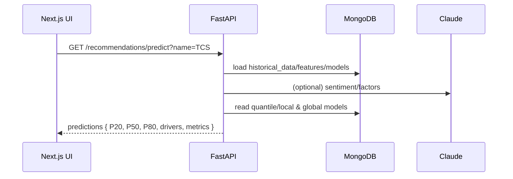
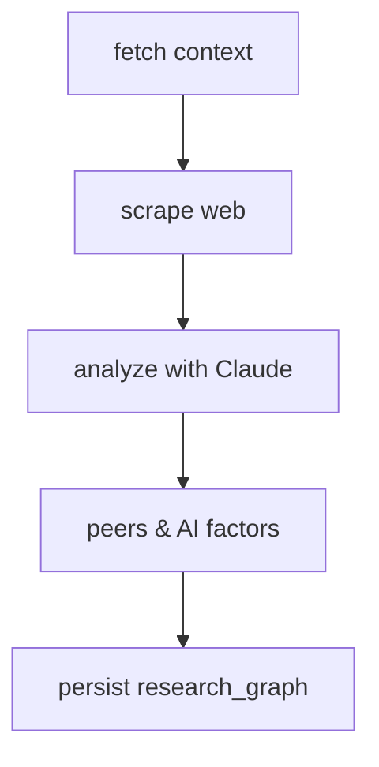

# Investment Advisor – End-to-End Research, Forecasting, and Insights

This project is a full‑stack research and forecasting assistant for Indian equities. It ingests market data, fundamentals and announcements, augments with AI research (Anthropic via LangChain/LangGraph), engineers features, trains quantile time‑series models, and serves interactive predictions with explainability and charts.

## Table of Contents
- Overview
- Architecture
- Data Sources and Collections
- Feature Store (features_daily)
- Modeling: Local, Global, and Ensembling
- AI Research: LangChain + LangGraph
- Backtesting and Accuracy
- API Reference
- Frontend UX
- Dev Setup
- Schedules and Automation

---

## Overview
- Pulls stock details, historical prices, historical stats, corporate actions, recent announcements, 52‑week levels, and price shockers.
- Aggregates news (company + industry; peers), with scraping fallbacks (BeautifulSoup, Scrapy, Selenium).
- Uses Anthropic (Claude) to extract numeric forward factors, summarize news, and produce peer‑aware research via LangChain and LangGraph.
- Builds a daily feature store per symbol (`features_daily`).
- Trains quantile LightGBM models (local per symbol, and global across symbols). Produces P20/P50/P80, SHAP drivers, and blends global/local P50.
- Backtests with expanding windows and returns quantile series.
- Persists everything in MongoDB; logs metrics/events to BigQuery.
- UI exposes prediction, research, backtest, feature build, and training controls with rich charts and toasts.

## Architecture
```mermaid
flowchart LR
  subgraph FE[Frontend (Next.js)]
    RECO[/Recommend Page/]
  end
  subgraph BE[Backend (FastAPI)]
    R[routers/*]
    S[services/*]
    DB[(MongoDB)]
    BQ[(BigQuery)]
  end
  subgraph EXT[External]
    IND[Indian Stock API]
    CLAUDE[Anthropic]
    WEB[Public Web]
  end

  RECO -->|HTTP| R
  R --> S
  S <--> DB
  S --> BQ
  S -->|HTTP| IND
  S -->|LLM| CLAUDE
  S -->|scrape| WEB
```

### Key modules
- `services/indian_api.py`: typed HTTP client to the Indian stock API.
- `services/aggregation.py`: bulk sync of stocks, prices, stats, actions, announcements, news.
- `services/feature_store.py`: materialize `features_daily`.
- `services/train.py`: local/global quantile training with SHAP.
- `services/recommendations.py`: enriched forecasting (signals, AI, quantiles, drivers), research orchestration.
- `services/langgraph_pipeline.py`: LangGraph workflow (fetch → scrape → analyze → peers & factors).
- `services/scraping.py`: BeautifulSoup + Scrapy + Selenium fallbacks.
- `services/bq.py`: BigQuery logger.

## Data Sources and Collections (Mongo)
- `stock_details`: base metadata, riskMeter, industry.
- `historical_data`: price time series per symbol/period/filter.
- `historical_stats`: fundamentals time series (Sales etc.).
- `corporate_actions`: meetings/events.
- `recent_announcements`: latest filings/announcements.
- `fiftytwo_week`: 52‑week highs/lows.
- `price_shockers`: market shockers list.
- `news`: latest market news pool.
- `intel_daily`: daily intelligence (signals, facts) per symbol.
- `predictions_daily`: enriched predictions saved by day.
- `research_daily`: saved research summary per day.
- `ai_predictions_daily`: raw AI horizon predictions per day.
- `features_daily`: engineered features + targets for horizons.
- `models_cache`: serialized models, metrics, SHAP, and blend alpha.

## Feature Store (features_daily)
Each day per symbol we write:
- Technicals: close, ret_1d, vol_20, DMA20/50, momentum, proximity to rolling max/min.
- Fundamentals/Events: riskMeter, sales_growth, corp actions counts.
- Sentiment: from announcements/news (Claude or heuristic), smoothed.
- Peer aggregates: peer_risk_mean, shock rate, etc.
- AI factors: forward_eps_growth, demand_outlook, cost_pressure, etc.
- Targets: `target_1`, `target_5`, `target_10` (future close at +h).

## Modeling
- Local model per symbol per horizon (LightGBM quantile: P20/P50/P80).
- Global model across symbols for the same horizons.
- Ensemble: P50_local blended with P50_global (simple average; tunable).
- SHAP: computed for P50 to rank top drivers; returned with predictions.

## AI Research (LangChain + LangGraph)
- LangChain wrapper over Claude for:
  - Sentiment extraction.
  - Numeric factor extraction.
  - Research bullets and plan.
- LangGraph orchestrates nodes: fetch context → scrape → analyze → peers & factors.
- Results are persisted into `research_graph`.

## Backtesting and Accuracy
- Expanding‑window backtest retrains at each step and reports MAE and series.
- Quantile series by date (q20/q50/q80) returned for band charts.
- Rolling accuracy endpoint compares saved predictions vs realized prices and returns MAE for last N days.

## API Reference (selected)
- Predictions:
  - `GET /api/recommendations/predict?name=TCS&days=1,5,10`
  - `GET /api/recommendations/research?name=TCS&days=1,5,10`
  - `GET /api/recommendations/research-graph?name=TCS`
  - `GET /api/recommendations/accuracy?name=TCS&horizon=5&window_days=120`
- Market/ETL:
  - `POST /api/market/features?name=TCS`
  - `POST /api/market/train?name=TCS`
  - `POST /api/market/train-global`
  - `GET /api/market/backtest?name=TCS&horizon=5&window_days=365`
- Admin/health:
  - `GET /api/health/models-cache`

## Frontend UX (Next.js)
- Recommend page exposes:
  - Inputs: stock name, horizons.
  - Actions: Predict, Research + Save, Backtest, Build Features, Train Models, Train Global, Set Blend.
  - Charts: prediction bands (P20/P50/P80), backtest P50 with bands.
  - Drivers: SHAP bar chart.
  - Toaster notifications (sonner) on every action.
  - Real‑time accuracy (from backtest) visible on the page.

## Dev Setup
- Backend
  - Python 3.12+ recommended; create venv and install requirements:
    - `python3 -m venv .venv && source .venv/bin/activate`
    - `pip install -r backend/requirements.txt`
  - Configure `backend/.env` with keys:
    - `ANTHROPIC_API_KEY`, `INDIAN_STOCK_API_KEY`, `MONGODB_URI`, `BIGQUERY_PROJECT_ID` (optional).
  - Run API: `uvicorn app.main:app --app-dir backend --host 127.0.0.1 --port 8010 --reload`.
- Frontend
  - `cd frontend && npm i && npm run dev`
  - Open `http://localhost:3000/recommend`.

## Schedules and Automation
- Nightly (suggested): sync → features → train local/global → log metrics → email report.
- Blend alpha can be optimized weekly from rolling backtests.

## Mermaid: Prediction Request Flow


## Mermaid: Research Graph


---

For more, see the code in `backend/app/services/*` and `frontend/src/app/recommend/page.tsx`. Contributions welcome!
